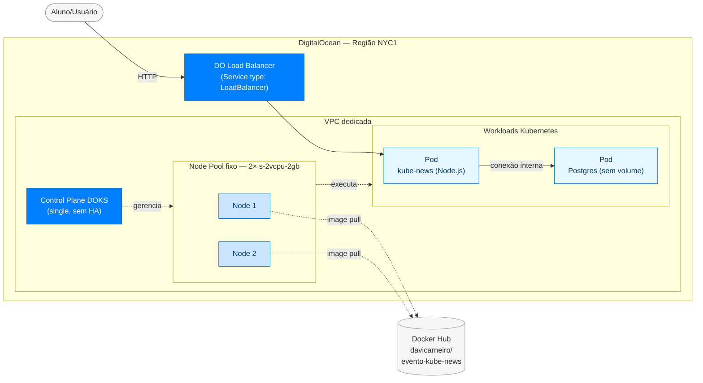

# Arquitetura cloud na DigitalOcean para o kube-news

## Contexto

O `kube-news` é uma aplicação Node.js/Express usada como artefato didático para aulas de containers, Kubernetes e CI/CD. Até este momento, a execução do projeto acontecia apenas localmente via Docker Compose, o que cobre a parte de containerização mas não permite demonstrar Kubernetes real em ambiente gerenciado.

O gatilho desta definição é a necessidade de **criar um ambiente Kubernetes em cloud** para uso em aulas de demonstração, mostrando aos alunos o comportamento de um cluster gerenciado real — scheduling, exposição via Service LoadBalancer, integração com recursos cloud do provedor.

A escolha do provedor (DigitalOcean) está fixada como premissa do projeto didático.

## Problema

O ambiente local com Docker Compose não substitui a experiência de um cluster Kubernetes real em cloud. Especificamente, **não há hoje um cluster Kubernetes gerenciado disponível** para rodar a aplicação em aulas de demonstração.

Escopo: aula de demonstração — não é ambiente produtivo, não é ambiente persistente entre aulas, não atende SLA.

## Solução proposta

Provisionar na DigitalOcean um cluster Kubernetes gerenciado (DOKS) com os componentes mínimos necessários para hospedar a aplicação e expô-la publicamente para a demonstração.

**Diagrama da arquitetura:**

**Componentes:**

| Componente | Especificação |
|---|---|
| Serviço de cluster | DOKS (DigitalOcean Kubernetes) |
| Versão do Kubernetes | Mais recente disponível no DOKS |
| Control plane | Single (sem HA) |
| Node pool | Fixo em 2 nodes, sem autoscaler |
| Tipo de node | `s-2vcpu-2gb` |
| Região | NYC1 |
| Networking | VPC dedicada para o projeto |
| Exposição externa | DigitalOcean Load Balancer (provisionado pelo Service `type: LoadBalancer` da aplicação) |
| Container Registry | Docker Hub externo (`davicarneiro/evento-kube-news`) |
| Monitoramento DO | Desabilitado |
| Backup/Snapshot | Desabilitado |

**Custo estimado mensal (cluster ligado 24/7):**

| Item | Valor |
|---|---|
| DOKS control plane (sem HA) | US$ 0 |
| 2× `s-2vcpu-2gb` (US$ 18/mês cada) | US$ 36 |
| 1× Load Balancer regional (1 node) | US$ 12 |
| VPC | US$ 0 |
| **Total** | **~US$ 48/mês** |

Valores consultados em maio/2026 nas páginas oficiais de preço da DigitalOcean (Droplets e Load Balancers). Preços sujeitos a alteração pela DO.

O cluster é destinado a ser ligado apenas durante o uso didático e destruído fora de aula, reduzindo o custo efetivo.

**Mapa de impacto:** a arquitetura é greenfield — não há recursos cloud prévios sendo modificados. O Docker Hub permanece como registry externo, sem alterações de configuração do lado do registry.

## Alternativas

1. **Outro provedor cloud (AWS EKS, GCP GKE, Azure AKS).** Descartado: a DigitalOcean é a escolha didática do projeto, alinhada ao público da aula e à simplicidade da plataforma.

2. **HA no control plane do DOKS (+US$ 40/mês).** Descartado: ambiente de demo não exige SLA premium; custo adicional não se justifica.

3. **Node pool com autoscaler (min/max).** Descartado em favor de pool fixo: custo previsível e menor complexidade didática.

4. **DOCR (DigitalOcean Container Registry).** Descartado: a pipeline GitHub Actions já existente publica em Docker Hub; manter o registry atual evita retrabalho.

5. **VPC default da conta.** Descartado em favor de VPC dedicada para isolamento de outros recursos eventualmente presentes na conta.

6. **Banco gerenciado (DO Managed Postgres).** Descartado: a demo executa o Postgres dentro do próprio cluster Kubernetes como parte da demonstração didática, sem necessidade de banco gerenciado externo.

7. **Ingress Controller compartilhando 1 Load Balancer.** Descartado: cluster hospeda uma única aplicação, sem necessidade de TLS/domínio próprio; Service `LoadBalancer` direto é mais simples didaticamente.

## Riscos

1. **Rate limit do Docker Hub.** Pull anônimo limita 100/6h por IP. Com 2 nodes saindo do NAT da DO, demonstrações com múltiplos `rollout restart` podem estourar o limite.
   - **Sinal pós-deploy:** pods em estado `ImagePullBackOff`.
   - **Mitigação:** aceito o risco; eventual autenticação do Docker Hub pode ser adicionada futuramente se o problema ocorrer.

2. **Sem HA = SLA 99.5%.** Control plane pode ficar indisponível em janelas de manutenção da DigitalOcean.
   - **Sinal:** `kubectl` retornando erro de conexão à API do cluster.
   - **Mitigação:** aceito; ambiente é de demonstração.

3. **Pool fixo de 2 nodes sem autoscaler.** Se um node cair (manutenção ou falha de hardware), o cluster fica com 1 node de 2 GB, e pods podem não caber.
   - **Sinal:** pods em estado `Pending` por falta de recursos.
   - **Mitigação:** aceito; recriar o pool ou aumentar nodes manualmente se necessário.

4. **Sem persistência no Postgres.** Como o banco roda dentro do cluster sem volume persistente (decisão de manifesto, com reflexo cloud), não há snapshot/backup a configurar no nível cloud.
   - **Sinal:** dados desaparecem em qualquer restart de pod do banco.
   - **Mitigação:** aceito; comportamento esperado para demo.

5. **Custo correndo 24/7.** Cluster ligado fora do horário de aula representa ~US$ 48/mês de desperdício.
   - **Sinal:** fatura mensal da DigitalOcean.
   - **Mitigação:** destruir o cluster fora dos períodos de uso didático.

6. **Auto-upgrade automático do Kubernetes pela DO.** A versão "mais recente" pode receber patch durante a aula, causando restart de nodes.
   - **Sinal:** nodes reiniciando inesperadamente; pods sendo reagendados.
   - **Mitigação:** aceito; eventualmente configurar janela de manutenção fora dos horários de aula.
